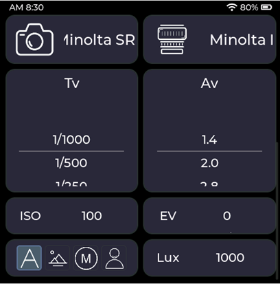
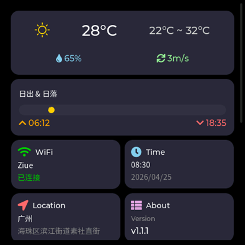
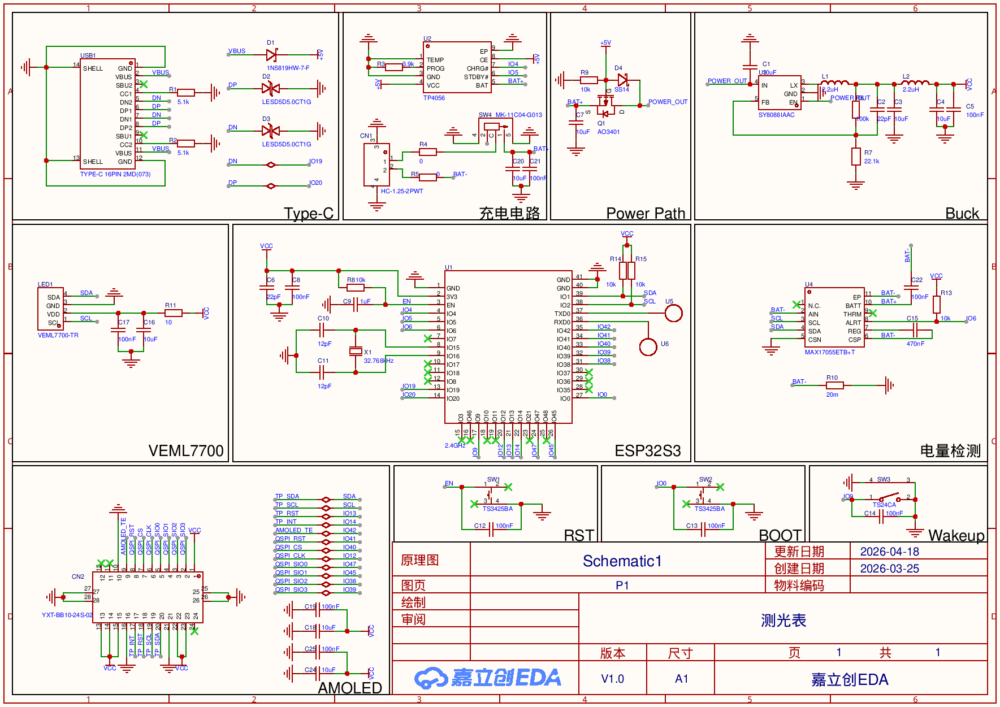

# LightMeter-ESP32

A professional incident-light exposure meter for film photography, built on ESP32-S3 with a 460×460 AMOLED touchscreen.

[中文版本](README.md)

## Features

**Exposure Meter**
- Incident-light metering via VEML7700 ambient light sensor
- Four modes: Manual, Auto (aperture priority), Landscape (f/11 bias), Portrait (wide-open bias)
- 1/3 EV and 1/2 EV step support
- Standard aperture (f/0.5–f/128) and shutter (30s–1/8000s) tables
- Out-of-range, overexposure, underexposure, and slow-shutter warnings

**Camera & Lens Management**
- Multiple camera profiles with shutter range and flash sync speed
- Multiple lens profiles with aperture range and focal length
- T9 keyboard for custom naming

**Connectivity**
- WiFi with auto-reconnect and multi-SSID memory
- Auto-location via WiFi AP scanning (cellocation API)
- SNTP time sync with automatic timezone from longitude
- 3-day weather forecast, moon phase, sunrise/sunset (QWeather API)

**Power Management**
- MAX17055 fuel gauge for battery SOC and voltage
- TP4056 charge detection (charging / full / discharging)
- Deep sleep with RTC time preservation
- Long-press GPIO9 key (3s) to enter deep sleep

**UI**
- 460×460 AMOLED with capacitive touch
- Roller-style selectors for ISO, aperture, shutter, EV compensation
- Real-time WiFi signal, battery, and lux indicators
- OTA firmware update (AP hotspot + HTTP upload)

## Screenshots





## Hardware

| Component | Part |
|-----------|------|
| MCU | ESP32-S3N16R8 (16MB Flash, 8MB Octal PSRAM) |
| Display | 460×460 QSPI AMOLED ([CO5300](https://yuyinglcd.com/ch/products/2/5/512)) |
| Touch | CST820 (I2C) |
| Light Sensor | VEML7700 (I2C) |
| Fuel Gauge | MAX17055 (I2C) |
| Charger | TP4056 |
| Power | SY8088 DC-DC buck converter |
| Battery | 300mAh Li-Po |

### Schematic



Full schematic PDF and chip datasheets are available in the [`Datasheet/`](Datasheet/) directory. PCB project files are in [`hardware/`](hardware/).

## Build

Requires [ESP-IDF v5.2](https://docs.espressif.com/projects/esp-idf/en/v5.2/esp32s3/index.html).

```bash
idf.py set-target esp32s3   # first time only
idf.py build
idf.py -p /dev/ttyACM0 flash
idf.py -p /dev/ttyACM0 flash monitor
```

Shortcut: `./idf.sh B` (build+flash), `./idf.sh BM` (build+flash+monitor).

## External Dependencies

- [lvgl/lvgl](https://github.com/lvgl/lvgl) ^8
- [espressif/esp_lcd_touch](https://components.espressif.com/components/espressif/esp_lcd_touch) ^1.1.2
- [esp-idf-lib/veml7700](https://components.espressif.com/components/esp-idf-lib/veml7700) ^1.0.7

Managed by ESP-IDF Component Manager (`idf_component.yml`).

## Project Structure

```
main/
├── main.c                    # Entry point — peripheral init, LVGL init
├── app_controller.c/h        # Central orchestrator — tasks, queues, semaphores
├── app_ui.c/h                # LVGL UI implementation
├── app_ui_*_port.c/h         # UI port layer (bridge LVGL callbacks → logic)
├── app_exposure_calc.c/h     # Exposure calculation engine
├── app_location.c/h          # Google Geolocation API client
├── app_weather.c/h           # QWeather API client
├── app_time.c/h              # SNTP time sync + RTC persistence
├── app_battery.c/h           # Unified battery API (MAX17055 + TP4056)
├── app_http_requests.c/h     # HTTP client helpers
├── app_nvs_storage.c/h       # NVS persistence layer
├── hw_oled.c/h               # QSPI AMOLED display driver
├── hw_wifi.c/h               # WiFi init, scan, connect state machine
├── hw_veml7700.c/h           # VEML7700 light sensor driver
├── hw_max17055.c/h           # MAX17055 fuel gauge driver
├── hw_tp4056.c/h             # TP4056 charge detector
├── hw_ota.c/h                # OTA firmware update (HTTP)
├── hw_wakeup_key.c/h         # GPIO9 wake-up key
├── bsp_i2c_init.c/h          # I2C bus init
├── img_*.c                   # Embedded image assets
├── clock_icon.c              # Analog clock face
├── qweather_icons.c          # Weather condition icons
└── SourceHanSansCN_Regular.c # Chinese font (Source Han Sans CN)
```

## Architecture

**Controller Pattern** — `app_controller.c` is the central hub. All inter-task communication uses FreeRTOS queues and semaphores.

**Connectivity Chain** — WiFi connection triggers a serial chain via semaphores:

```
WiFi Connected
  → Location (cellocation API)
    → Time sync (SNTP + timezone from longitude)
      → Weather (QWeather 3-day forecast + moon phase)
```

Each step retries 3 times. Cached data is displayed on boot so the UI is never blank.

**LVGL Thread Safety** — UI updates from non-LVGL tasks must wrap with `lvgl_lock(-1)` / `lvgl_unlock()`.

See [docs/软件系统组成.md](docs/软件系统组成.md) and [CLAUDE.md](CLAUDE.md) for detailed architecture documentation.

## Calibration

`docs/calibrate_veml7700.py` — Python script for VEML7700 lux calibration against reference measurements.

## License

MIT
